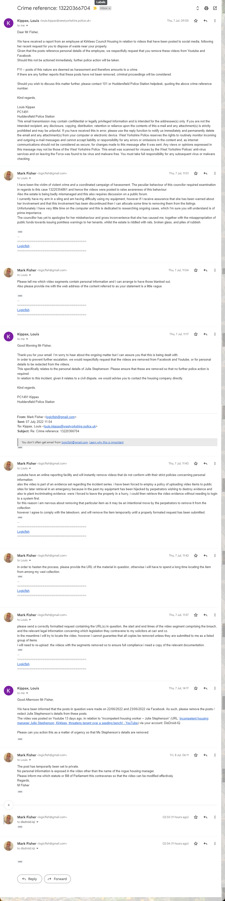

## Threats by kirklees housing officers

Earlier this month I received the following erroneous communication from *Julie Stephenson at Kirklees Council*.

As one can see in this video, there are no "items dumped outside"!

<iframe width="320" height="406" src="https://www.youtube.com/embed/RCN_DZ5qgjw" title="Incompetent housing manager Julie Stephenson, Kirklees, threatens tenant over a seeding bench!" frameborder="0" allow="accelerometer; autoplay; clipboard-write; encrypted-media; Julie Stephenson at Kirklees Council*gyroscope; picture-in-picture" allowfullscreen></iframe>

And you can also see, none of Stephenson's personal details were exposed. However, rather than resolve the issue with an apology, she took the provocatory step of attempting to involve the police.

On top of this, she has also attempted to maintain that my posting a video exposing her misdeeds was "anti-social" and comprised a "breach of my tenancy agreement"!

So she has now made three non-resolutory points of contact,  compared to my single point, comprising acts of harassment against myself, and forming part of an ongoing series of attacks that began when I helped the police to [disband a child trafficking cartel in the Colne Valley](https://disdroid.co.uk/carters-colne-valley-cartel).

However, she did not stop here. When Stephenson saw the video, she suffered a psychological breakdown at the prospect of having her misdemeanours uncovered.

She decided to use her gangland contacts to instigate the most horrendous assault against me. Luckily, I spotted the ring lying in wait for my partner and was able to intercept their campaign. They panicked and conducted their assault in broad daylight, in front of multiple witnesses, and will not be able to escape an extended jail term.

See these photographs to learn the extent of my injuries.

<iframe width="640" height="480" src="https://www.youtube.com/embed/B9XCKC9Cu-Y" title="2022 07 07 122328" frameborder="0" allow="accelerometer; autoplay; clipboard-write; encrypted-media; gyroscope; picture-in-picture" allowfullscreen></iframe>