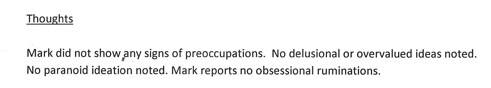

Mark is well known by the police for taking out cyber-revenge against bogus operations, whilst supporting genuine ones. Upon discovering that Operation Ore (which even had Pete Townsend arrested!) was fraudulent, having wasted their funds on a cheap and nasty web front end whilst living it up on holiday, it took him around 30 minutes to destroy their computer and to have their offices raided by defense staff which he watched live on an open camera found using the [shodan internet device search engine](https://www.shodan.io/). He also helped to reverse engineer a network of covert sites run by pedophile ring, resulting in a [series of arrests worldwide](https://disdroid.co.uk/carters-colne-valley-cartel).

### Mark Fisher has also been seen in the company of senior defense staff, and although the extend of his involvement here has not been disclosed, he is rumoured to have worked on defense projects.

Interestingly, the pedophile ring takedown occured shortly after the MOD released a public statement basically authorising agents to use the skills taught at the MOD against human traffickers and internet pedophile rings.

So the police cartel decided that Mark had to be "covered up" before their raids, otherwise their cover would be blown. Along with his colleague Andrew Kelly (a bloodline descendent of the outlaw Ned Kelly) had thwarted repeated attempts on their lives by using social media to alert diconnected third parties in their extensive networks to the danger that they were in, focing them to make the step of public disclosure of the operation set. This came in conjunction with their usage of multiple internet services in conjunction to store gathered evidence in a way that could not easily be deleted by the hackers who repeatedly entered our systems. 

### They also developed ways to direct huge amounts of traffick from youtube and google, giving them leverage equal to any minor news outlet

Thanks to well-meaning socialists, the outdated laws governing the internet meant that it was very easy for the cartel to conjure up a stack of false charges, which they used to imprison Mark during the raids. District Judge Micheal Fanning sentenced him to be locked up with the key thrown away under a hospital order, the private details of which were leaked to the press and published without his consent, solely by the Maxwell/Trichan cartel - no other papers carried the story due to legal reasons.

## These personal details are still on public display

This is the [daily mirror article about Mark:](https://archive.ph/8Y6km)

Another paper owned by the Maxwell press, "The Examiner", also known by the alias "Examiner Live", also [published an article containing private medical information](https://archive.ph/KKloo).

### So for awareness we will now publish further medical details, after having obtained Mark's consent

Firstly though, we should point out that the subject of Marks "malicous communications" finally received a ten year sentence for child rape after being [cleared several times for similar offences by Huddersfield Magistrates Court](https://archive.ph/GS4JR) - however the doctors refused to release him for almost a full year, until protests and activism by staff and patients at the hospital put them in a very awkward position. He was eventually released and in 2018 was discharged back to his GP with no apparent symptoms.

Notes by the doctor:

The evidence produced by the cartel was of course fabricated, comprising manipulated images of his website to conceal the evidence and portray a deliberately offensive version. Rather than learn their lesson, cartel members including police officers have constructed further false evidence sets, which they are now using against him in sequence! 
Let's face it, they're running scared.