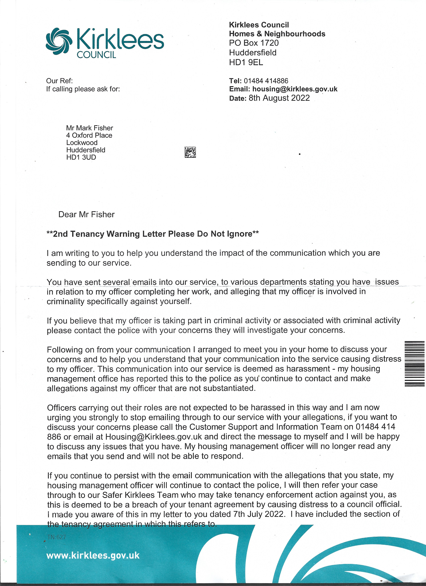
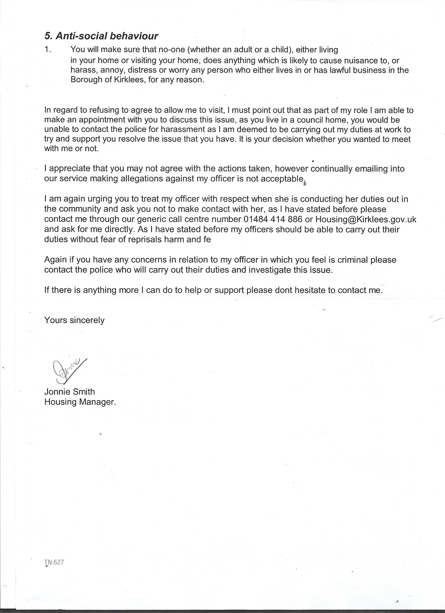
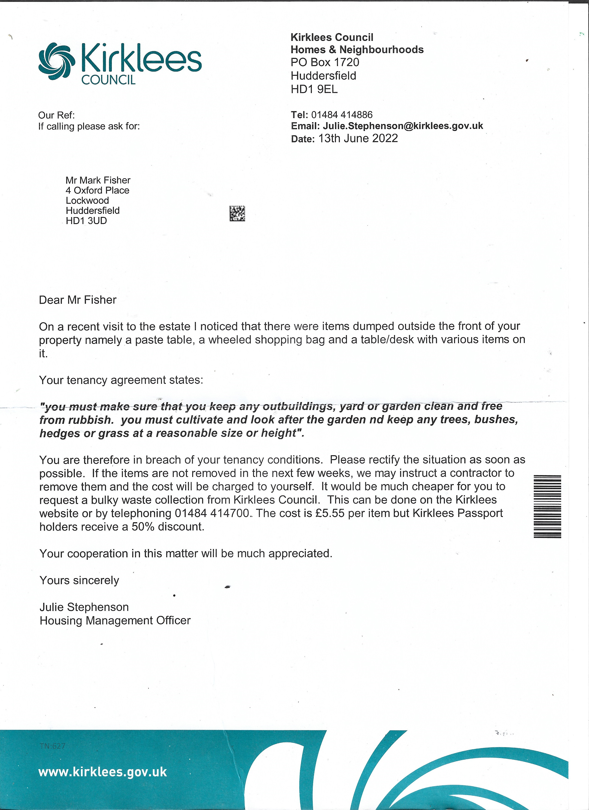

### Tracking the timeline between a series of criminal assaults and suspicious activity by Kirklees Council officials.

Despite having been warned that this matter is now in police hands, rather than wait until the investigation into his involvement in a child trafficking ring is concluded, this councillor panics and decides to escalate. This was his preference, rather than resolve [the issue described here](https://disdroid.vercel.app/kirklees-council-cartel) by apologising.

### Let's go through the issues raised here, one by one.

I have direct evidence of collusion between your officer and criminal gangs, coincident on the timeline with the threatening material delivered to me from Kirklees Council. **OF COURSE THIS IS REPORTED TO THE POLICE!** Every message I receive from Kirklees Council gets sent to the police immediately, before I even read it myself.

You arranged to meet yourself at my home, which you did, as we can see on the recording from my security camera. You had already been informed that the matter had been handed over to the police and were to make no further contact, pending the investigation of your officer for child trafficking.

The "communication into your service" does not fit the legal definition of harassment, since it was in response to needless and pointless communications from your office that were of a threatening and provocatory nature, comprising part of a continued harassment campaign against myself that has been ongoing as described in this article: **[Colne Valley's Urban Cartel](https://disdroid.co.uk/carters-colne-valley-cartel)**. Your office made several point of contact, none of which were by an officer "going about her duty".

**The only "distress" that I have caused to your officer was to inform her, and the public, of the suspicious nature of her activities**

She was actually parked in her car watching the incident where I was mugged by cartel members in an attempt to steal my mobile device in order to plant false evidence and to harass my contacts, that resulted in these serious injuries to myself:

My only contact with this office, both in private and in public, has been in response to harassment originating at that office!

These are not "officers carrying out their roles" - the original contact, which came a few days before the assault, was a bogus claim that I had unecessary items stored outside my home. The following photographs prove that there are no such items.

She appears cognizant of, and even supportive of, the current craze of shoplifting rings going door to door, and dropping in on pubs and shops, selling meat stolen from a local butchers. When apprehended doing their "work", [the gang turn nasty and attack the shop staff](https://archive.ph/V2S60).

### I don't think that the clause in my tenancy about anti-social behaviour can apply to highlighting misdemeanours and criminal connections among the staff at Kirklees Council!

The officers distress at being informed that she would shortly be under investigation as part of a trafficking ring was caused by her own actions - not my short communications to THE PUBLIC EMAIL ADDRESS OF A PUBLIC SERVICE.